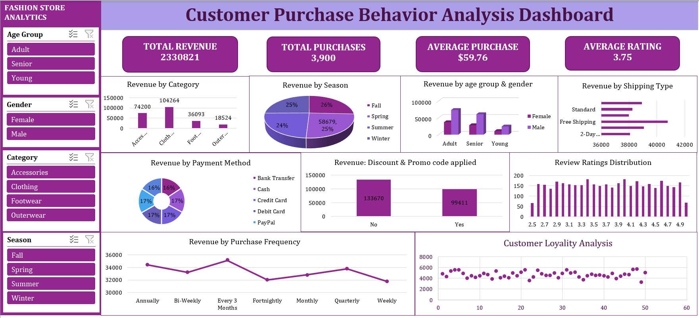

# 📊 Customer Purchase Behavior Analysis – Excel

## 📌 Project Overview

This project analyzes customer purchase data using Microsoft Excel to understand customer purchasing behavior, sales performance, and customer value.

The analysis transforms raw purchase data into meaningful business insights using Excel-based data cleaning, analysis, visualization, and dashboarding techniques.

## 🎯 Business Objectives

The main objectives of this analysis are to:

- Understand customer purchasing behavior
- Identify high-value customers
- Analyze sales and purchase patterns
- Identify top-performing products
- Segment customers based on their purchase behavior
- Identify opportunities to improve customer retention and sales
- Present key findings through an interactive dashboard

## 🛠️ Tools Used

- Microsoft Excel
- Excel Formulas
- Pivot Tables
- Pivot Charts
- Data Cleaning
- Data Visualization
- Dashboard

## 🔍 Analysis Performed

### 👥 Customer Analysis

- Analyzed customer purchasing behavior
- Identified high-value customers
- Examined customer spending patterns
- Segmented customers based on purchase behavior

### 🛍️ Purchase Analysis

- Analyzed purchase amounts
- Identified purchasing patterns
- Examined product performance
- Compared customer purchase behavior

### 📈 Sales Analysis

- Analyzed overall sales performance
- Identified products contributing to sales
- Examined revenue contribution
- Compared different customer segments

## 📊 Excel Dashboard

An interactive Excel dashboard was created to present important KPIs and analysis results in a simple and easy-to-understand format.

### Dashboard Preview



## 💡 Key Business Insights

The analysis helped identify important patterns in:

- Customer purchasing behavior
- Customer spending
- Product performance
- Sales contribution
- Customer segments

The dashboard provides a quick overview of the major performance indicators and helps identify areas that require business attention.

## 💼 Business Recommendations

- Focus on retaining high-value customers through targeted offers and personalized engagement.
- Promote products with strong sales performance.
- Analyze low-performing products and identify opportunities to improve their performance.
- Use customer purchase patterns to create targeted marketing campaigns.
- Monitor customer segments regularly to identify changes in purchasing behavior.
- Use the Excel dashboard to track important business KPIs and support data-driven decision-making.

## 📁 Project Structure

```text
customer-purchase-behavior-excel/
│
├── README.md
├── customer_purchase_analysis.xlsx
│
└── screenshots/
    └── customer_purchase_dashboard.png

## 🎓 Skills Demonstrated
- Data Cleaning
- Excel Formulas
- Pivot Tables
- Pivot Charts
- Data Analysis
- Data Visualization
- Dashboard Creation
- Customer Segmentation
- Business Insights
- Business Recommendations
## 🎯 Learning Outcome

This project strengthened my ability to use Microsoft Excel for business-oriented data analysis and demonstrated how raw customer data can be transformed into actionable insights and recommendations.

## 👩‍💻 Author

Geethika Dasari

Aspiring Business Analyst / Data Analyst
